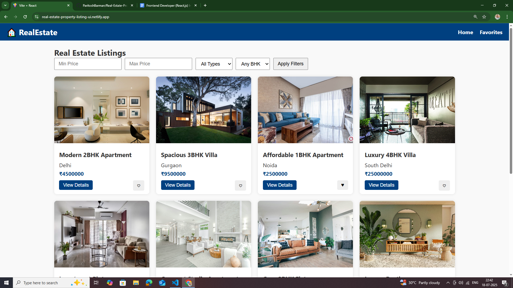
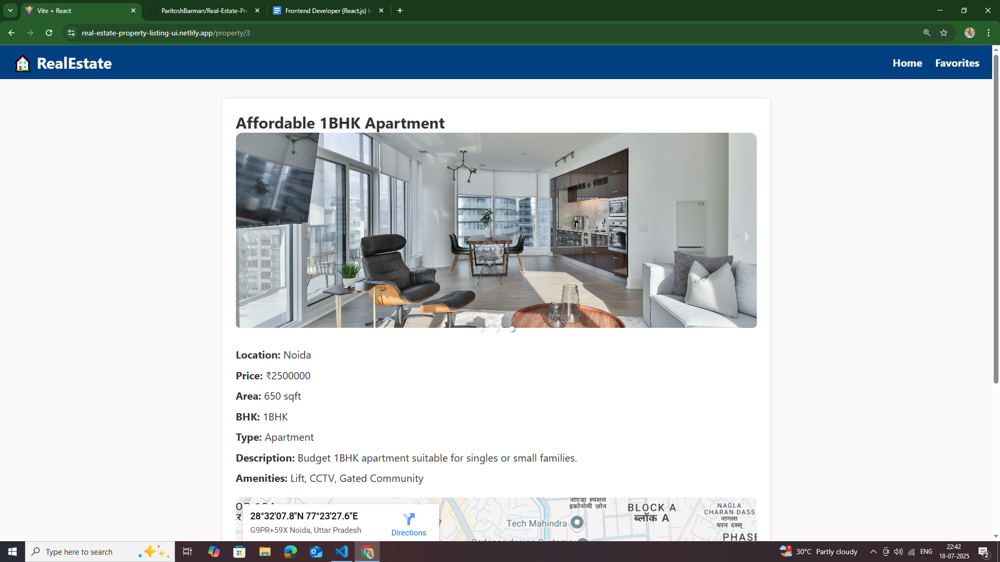
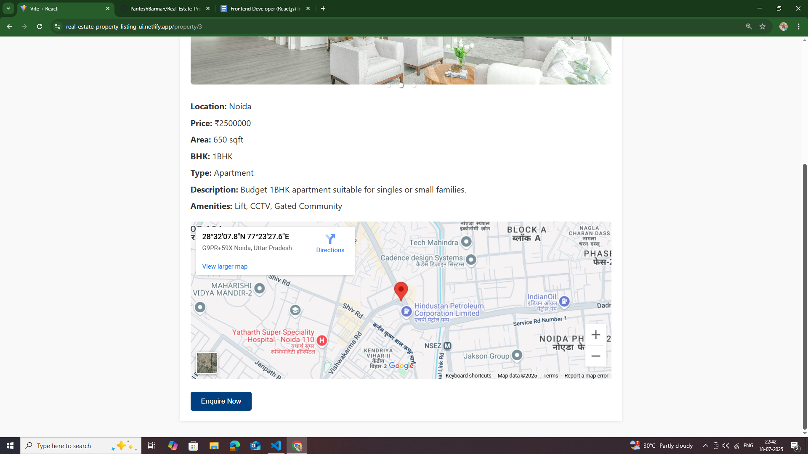
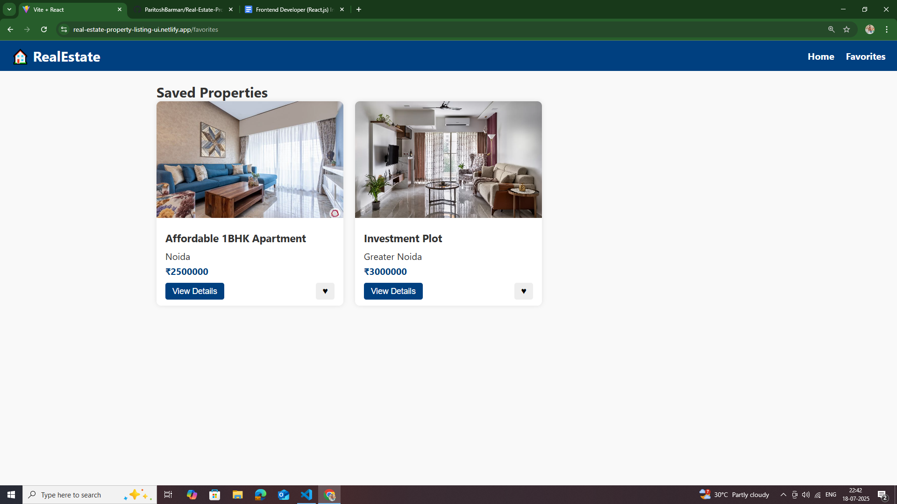
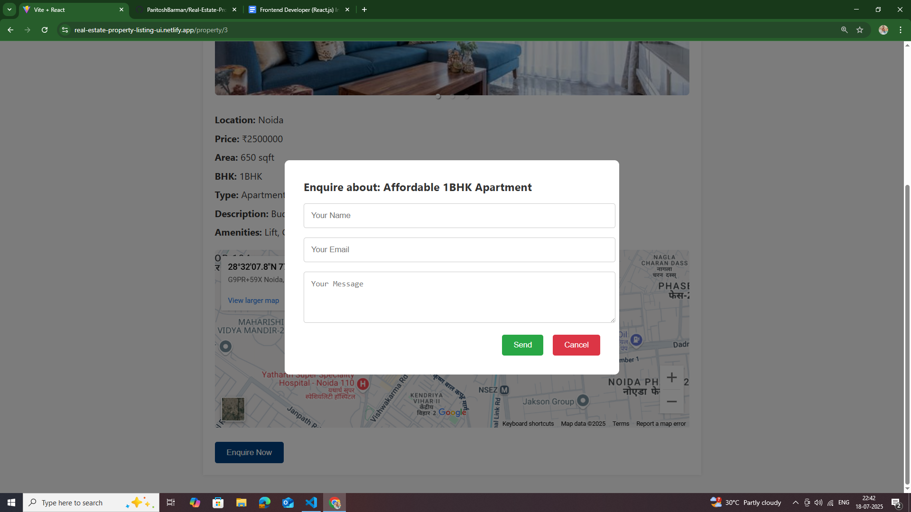
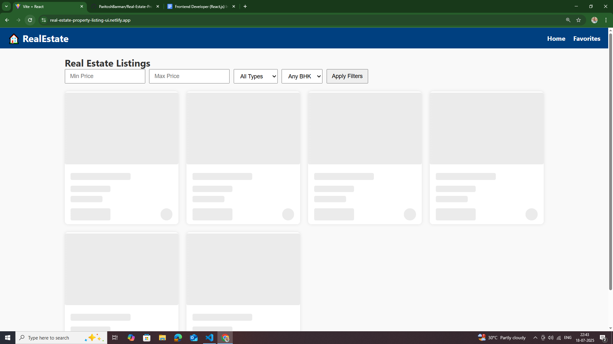

# 🏡 Real Estate Property Listing UI

A fully responsive and scalable React.js web application for listing and viewing real estate properties with filter, favorites, and detailed views.

### 🔗 Live Demo
[View Live Project](https://real-estate-property-listing-ui.netlify.app/)

### 📂 GitHub Repository
[GitHub Repo](https://github.com/ParitoshBarman/Real-Estate-Property-Listing-UI)

---

## 📸 Screenshots

| Page | Preview |
|------|---------|
| 🏠 Homepage |  |
| 🏡 Property Details |  |
| 📍 Location Map View |  |
| ❤️ Favorites Page |  |
| 📨 Enquiry Popup |  |
| ⏳ Skeleton Loader (while loading) |  |

---

## 🚀 Features

- Responsive grid view of real estate properties
- Property filters: Price range, BHK type, and property type
- Property details with image carousel, map, and amenities
- Enquiry form popup
- Save properties to Favorites using localStorage
- Client-side routing with React Router
- State management with Redux Toolkit
- Loading skeletons during data fetch
- Deployed on Netlify

---

## 🏗️ File Structure

```
real-estate-ui       
├── README.md        
├── eslint.config.js 
├── index.html       
├── package-lock.json
├── package.json     
├── public
│   ├── _redirects   
│   ├── properties.json
│   └── vite.svg
├── src
│   ├── App.css
│   ├── App.jsx
│   ├── assets
│   │   └── react.svg
│   ├── components
│   │   ├── Modal.jsx
│   │   ├── Navbar.jsx
│   │   └── PropertyCard.jsx
│   ├── index.css
│   ├── main.jsx
│   ├── pages
│   │   ├── Favorites.jsx
│   │   ├── Home.jsx
│   │   └── PropertyDetails.jsx
│   ├── redux
│   │   ├── favoritesSlice.js
│   │   └── store.js
│   └── styles
│       ├── Details.css
│       ├── Favorites.css
│       ├── Home.css
│       ├── Modal.css
│       ├── Navbar.css
│       └── PropertyCard.css
└── vite.config.js
```

---

## 🧑‍💻 Tech Stack

- React.js (with Hooks)
- React Router DOM
- Redux Toolkit (for state management)
- Axios (for API call simulation)
- CSS (Modular with custom styling)
- Skeleton Loader
- React Responsive Carousel
- Google Maps Embed API

---

## 🛠️ How to Run Locally

```bash
# 1. Clone the repository
git clone https://github.com/ParitoshBarman/Real-Estate-Property-Listing-UI.git

# 2. Navigate to the project folder
cd Real-Estate-Property-Listing-UI

# 3. Install dependencies
npm install

# 4. Run the development server
npm run dev

# 5. Visit in browser
http://localhost:5173/
```

---

## 📤 Submission Details

**Candidate Name**: Paritosh Barman  
**Submission for**: Frontend Developer (React.js) Internship  
**Deployed Link**: [Netlify Live](https://real-estate-property-listing-ui.netlify.app/)  
**GitHub Repo**: [GitHub](https://github.com/ParitoshBarman/Real-Estate-Property-Listing-UI)

---


Made with ❤️ by [Paritosh Barman](https://github.com/ParitoshBarman)
